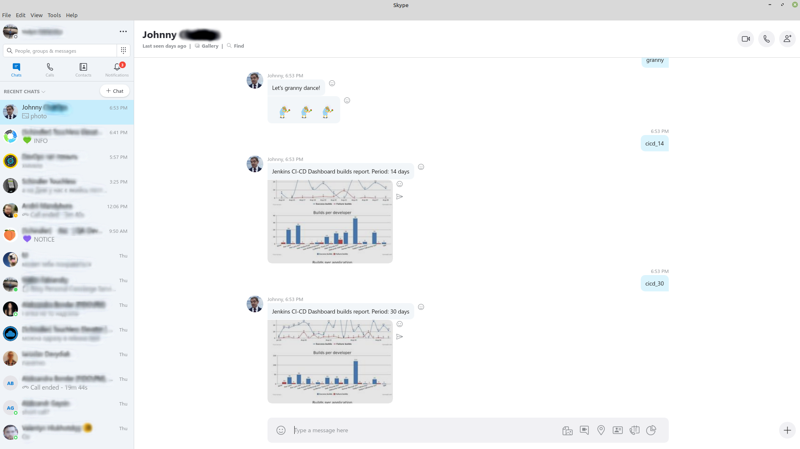
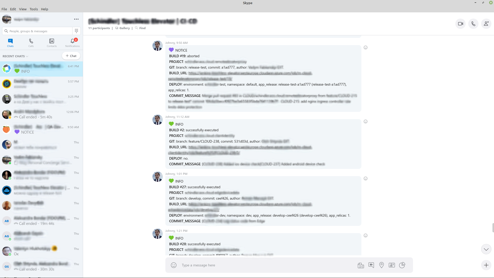
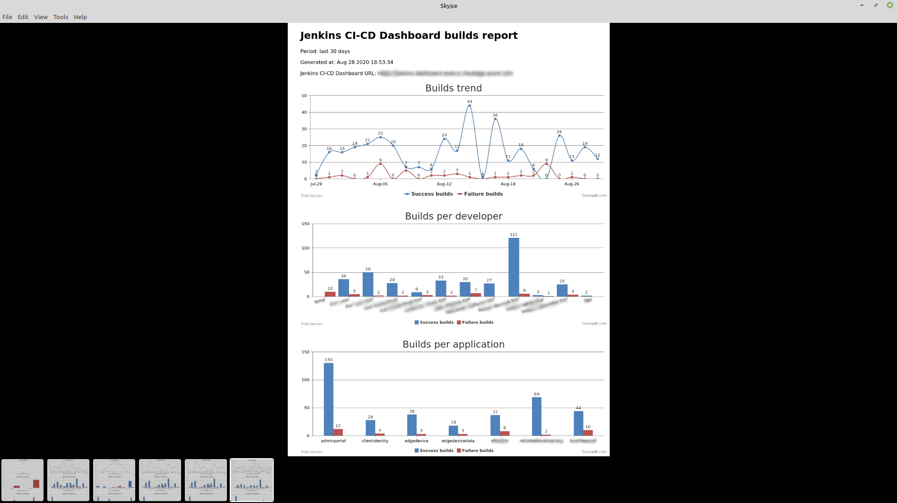

# skype-chatops
Skype chatbot and httpskype gateway applications.  
Sourcecode is not ready to publish yet. Used in several commercial environments.

## Features
**httpskype** - acts as http to skype gateway. Have an API endpoint that receives HTTP/POST messages, modifies it and routes to specific skype chat-group.   
**chatbot** - receives and executes commands from skype users. Commands:  
- basic commands
- get CI-CD system builds stats data from external system (with authentication enabled) + generate some charts and send it to skype
- analyze incoming messages from CI-CD system and update data in remote Google Spreadsheets file

## Screens
Skype chatbot application commands execution.

Skype httpskype gateway application messages from CI-CD system.

Skype chatbot application custom command execution - get CI-CD builds stats data from external system + generate some charts and send it to skype.

